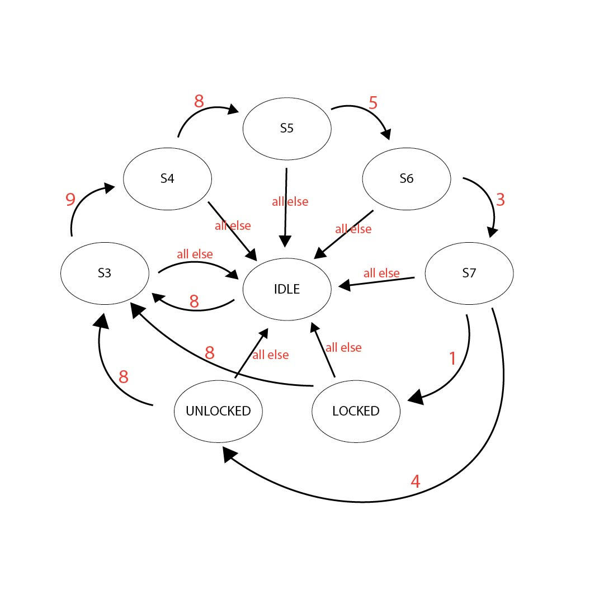

# README #

## What is this repository for? ##

This repository contains my submission for a Security Device that utilizes an FSM for my college class.

Here is the original [programming assignment](http://cs.iit.edu/~virgil/cs330/mail.fall2022/pa.html).

The code implements an FSM that has 8 states. **When the passcode 898531 is entered, the device locks. To unlock the device, enter 898534**. Any other inputs leaves the device in an idle state.




Any input that cannot be interpreted as an integer will be discarded before it reaches the FSM.

### How do I get set up? ###

Instructions in this README file are for a Windows 10 environment.

#### Summary of set up ####

You must have `gradle` installed before you can complete the setup.

#### Configuration (Main Device) ####

1. Clone the repository:
```
git clone https://github.com/HashMaster02/SecurityLockFSM.git
```

2. Make sure all the unit tests pass:
```
gradle test
```
Use your browser to view the test html report, it's at `./lib/build/reports/tests/test/packages/SecurityLockFSM.html`

3. Build an executable jar:
```
gradle jar
```

4. Run the executable:
```
java -jar ./lib/build/libs/app.jar
```
Enter characters from the keyboard, one at a time, followed
by Enter/Return. Entering the sequence **898531** and **898534** will Lock and Unlock the device respectively.

  Alternatively you can use the keyboard to enter multiple characters separated by space, e.g. '2 9 7 4 a r 4 1 4' followed by Enter/Return: the application will consume the symbols in the string one at a time and print 'Lock'/'Unlock' as it encounters the codes.

  You could also put data in a file and feed that data to the application, like this:
```
cat mydata | java -jar ./app/build/libs/app.jar
```

 or like this:
```
java -jar ./app/build/libs/app.jar < mydata
```

5. Generate jacoco unit-test coverage report:
```
gradle jacocoTestReport
```
Use your browser to load the html report, it's at `./app/build/reports/jacoco/test/html/SecurityLockFSM/index.html`

### Known bugs ###

* Strings that represent negative integers are returned by readInput() as positive integers, need to look into the Scanner class as to why.

#### Configuration (Hacking Attempt) ####
The project has a separate module that will attempt to hack into the locked device by generating random integers in the range 0-9 inclusive. This is done using the `Random` module in Java.

1. *Follow steps 1-3 from the previous section (Clone, Test, Build jar files)*

2. Run the executable:
```
java -jar ./hacktest/build/libs/hacktest.jar
```
The program will prompt you and ask for the number of times you would like to try and break the lock. **The higher the number, the greater the runtime, so be careful.** Afterwards, a few statistics will be shown:
- Total 6-digit combinations tested throughout all the hack attempts
- The maximum number of digits it took to unlock the lock in a single attempt
- The minimum number of digits it took to unlock the lock in a single attempt
- The average number of digits it took to unlock the lock (this figure is more accurate the more attempts you have as it provides a bigger sample)

### License ###

[GNU Public License](https://www.gnu.org/licenses/gpl-3.0.html)
